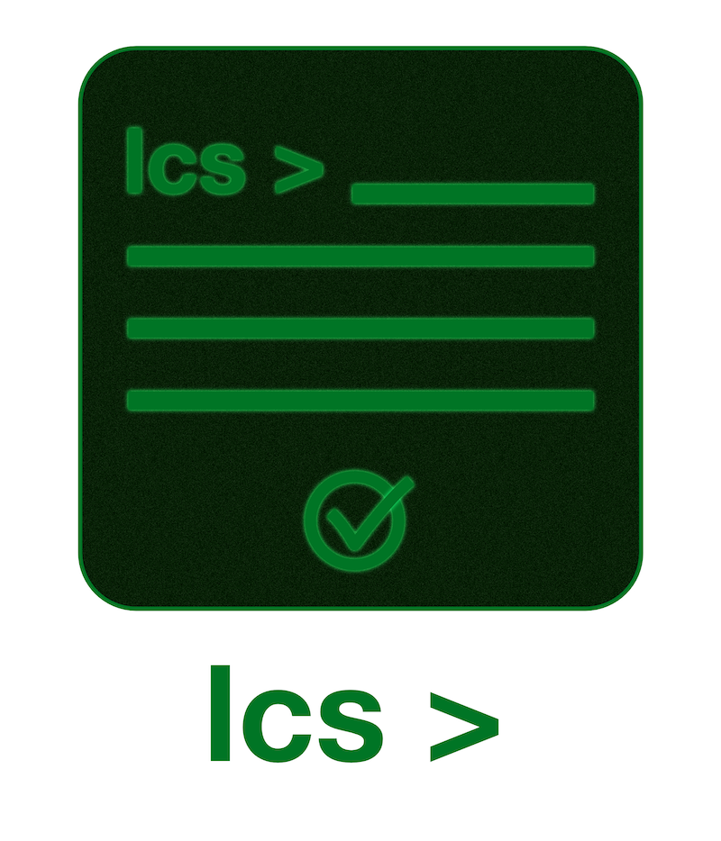

# go-lcs

go-lcs is a command-line tool for adding a LICENSE file where one might want it.

## Installation 

The `lcs` command-line application can be installed with the following command:

`go install github.com/Trashed/go-lcs/cmd/lcs@latest`

## How to use

### On Linux

On Linux, one could create a MIT license in the current directory by simply calling:

`lcs [argument] > LICENSE`

for example:

`lcs mit > LICENSE`

## Available licenses

| License                 | Argument        |
| ------------------------| ----------------|
| MIT                     | mit             |
| Mozilla Public License  | mozilla-public  |

